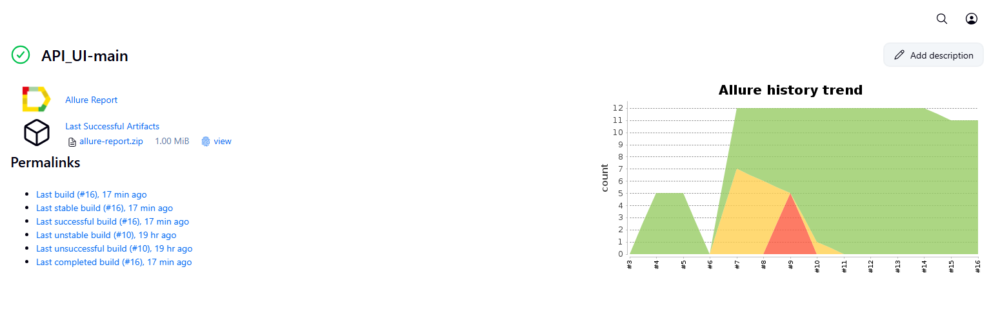

# API + UI Cart — учебный проект по автоматизации

> Репозиторий демонстрирует **два набора автотестов**:  
> 1) **Тренажёрные API‑тесты** на сервисе Reqres.in,  
> 2) **Комбинированные UI+API‑тесты** для корзины Demo Web Shop.  
>
> Проект учебный: отработка REST‑проверок (CRUD, статус‑коды, JSON‑схемы) и базовой связки через API в UI.

## Технологический стек

<p  align="center">
        
</p>

## Покрытый функционал

### 1) Тренажёрные **API-тесты** (папка `tests_api/`) — сервис **Reqres.in**

- Проверка получения списка пользователей (GET)
- Проверка получения конкретного пользователя (GET)
- Проверка ошибки при запросе несуществующего пользователя (GET)
- Проверка создания пользователя по схеме (POST)
- Проверка ошибки при регистрации без пароля (POST)
- Проверка обновления данных пользователя (PUT)
- Проверка удаления пользователя (DELETE)

---

### 2) Комбинированные **UI+API-тесты корзины** (папка `tests/`) — **Demo Web Shop**

- Авторизация через API и получение cookie
- Добавление товара в корзину через API и проверка успешного ответа
- Очистка корзины через API и проверка, что в UI корзина пуста
- Проверка, что добавленный через API товар отображается в UI

## Запуск

Установить зависимости и запустить все тесты:
```bash
python -m venv .venv && source .venv/bin/activate   # Windows: .venv\Scripts\activate
pip install -r requirements.txt
pytest -q
```

Только **API‑тесты** (Reqres):
```bash
pytest tests_api -q
```

Только **UI+API** (Demo Web Shop):
```bash
pytest tests -q
```
Локальная генерация отчёта Allure:
```bash
allure serve allure-results
```
## Allure Report
[Пример Allure Report](https://jenkins.autotests.cloud/job/API_UI-main)

<p align="center">
  
</p>
